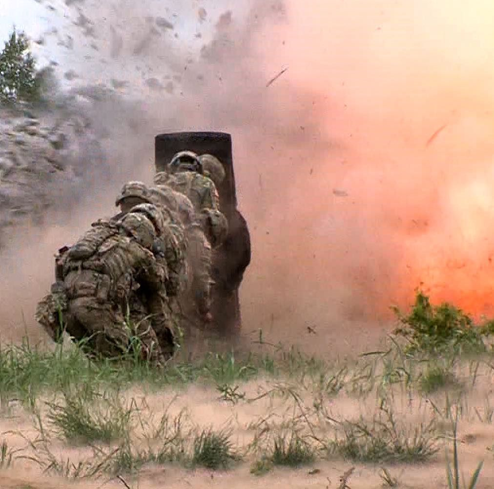

<!-- Main -->

<!-- One -->
<section id="one">
	

		<header class="major">
			<h2>Projects</h2>
		</header>
		
  Misc. work or non-work related projects I work on 

	

</section>

<!-- Two -->
<section id="two" class="spotlights">
	<section>
		
		

			

				<header class="major">
					<h3>Uniform or Not: An Image Classifier</h3>
				</header>
				
This is the first neural network I trained using 1983 images of individuals in uniform, and 1697 of random images. The model achieves 90% accuracy, which is not great for production but decent on my first foray into neural networks. 

				<ul class="actions">
					<li><a href="frontend.html" class="button">Learn more</a></li>
				</ul>
			

		

	</section>

<!-- Three -->

