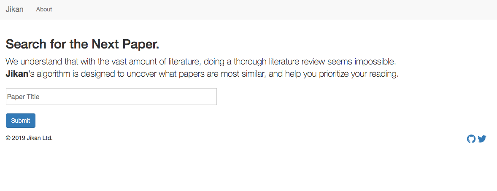

<!-- Two -->
<section id="two" class="simage">
	<section>
		
		

			

				<header class="major">
					<h3>Jikan: An Academic Paper Recommendation Engine</h3>
				</header>
				
 <strong>Jikan</strong> is an online tool designed to support researchers to perform systematic literature reviews. The underlying algorithm recommends papers for review to researchers based on the similarity of papers. 

				<ul class="actions">
					<li><a href="https://onyilam.github.io/2017/10/27/network.html" class="button">Learn more</a></li>
				</ul>
			

		

	</section>
	
	
<section id="two" class="image">
	<section>
		
		

			

				<header class="major">
					<h3>Uniform or Not: An Image Classifier</h3>
				</header>
				
This is the first neural network I trained the model using 2048 images of individuals in uniform, and 1840 of random images. The model achieves 88% accuracy. The motivation comes from wanting to understand whether certain media outlets are more likely to post pictures of individuals in uniform to emphasize on a narrative that resonates or sympathizes with the authority. 

				<ul class="actions">
					<li><a href="https://onyilam.github.io/2017/10/27/network.html" class="button">Learn more</a></li>
				</ul>
			

		

	</section>
	
	<section>
		
		

			

				<header class="major">
					<h3>Assessing Demographic Shock to Economic Recovery</h3>
				</header>
				
 This projects investigates the effect of a sudden demographic shock on intensity of economic activity. Demographics and macroeconomics interact and evolve in complementarity with each other and it is usually very difficult to disentangle the causal effect of demography on the economy. Studying Japan after the earthquake and tsunami in 2011 gives us this opportunity. We use the night light emission data to estimate the region’s economic recovery relative to year 2010. Our result suggests that death rate due to the disaster affects the subsequent economic recovery. The result is significant to 0.1% level. Furthermore, we found some evidence that the death rate of the elderly (65+) is insignificant in explaining recovery once we control for the 15-64 age group. Overall, demographic shock appears to only have a very transient effect on recovery.

				<ul class="actions">
					<li><a href="https://onyilam.github.io/tohoku.pdf" class="button">Learn more</a></li>
				</ul>
			

		

	</section>
	<section>
		
		

			

				<header class="major">
					<h3>Preventing Juvenile Interactions with the Criminal Justice System</h3>
				</header>
				
Juvenile offense can have severe detrimental effects on various life outcomes. Study has found that that early childhood intervention programs help to reduce future delinquency (Reynolds et al. 2001, Zigler et al. 1992), suggesting the benefit of identify at-risk children at a early stage. The current early warning system in the Milwaukee Public School is a heuristic approach based largely on teachers' intuition and experience. In this paper, we describe our work with the ShareData platform in the city of Milwaukee to develop a machine learning model to predict which students are at risk of interacting with the criminal justice system and the protective factors. Our approach significantly outperforms the heuristic method, identifying the same number of at-risk students while only flagging 33% as many students. Our work also sheds light on features related to family characteristics, and school performance that are predictive of juvenile interaction with the criminal justice system.

				<ul class="actions">
					<li><a href="https://onyilam.github.io/juvenile.pdf" class="button">Learn more</a></li>
				</ul>
			

		

	</section>
</section>

<!-- Three -->

