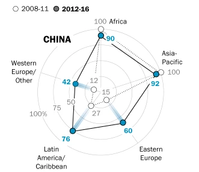
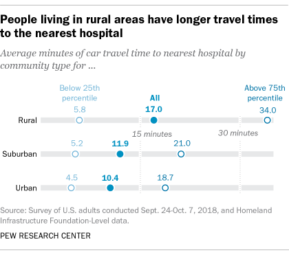
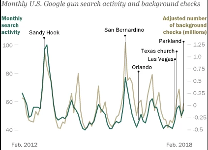
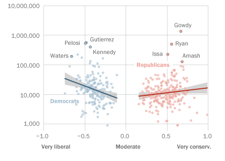
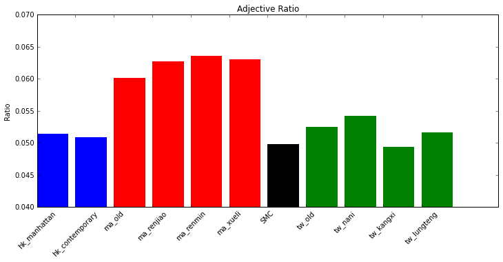

<!-- Two -->
<section id="two" class="spotlights">
	
	<section>
		
		

			

				<header class="major">
					<h3>How countries reviewed each other's human rights records</h3>
				</header>
				
Under a peer-to-peer evaluation process established in the late 2000s, every member state in the United Nations faces a periodic review of its human rights record by countries on the UN Human Rights Council. But the issues raised in these reviews can vary substantially depending on which countries are doing the reviewing... 

				<ul class="actions">
					<li><a href="https://www.pewresearch.org/fact-tank/2019/03/20/countries-have-different-priorities-when-they-review-each-others-human-rights-records/" class="button">Learn more</a></li>
					
				</ul>
			

		

	</section>
	
	
	<section>
		
		

			

				<header class="major">
					<h3>Distance to the Nearest Hospital</h3>
				</header>
				
To conduct this analysis, we used the addresses of a random sample of over 10,000 Americans using Pew Research Center’s nationally representative American Trends Panel. We then calculated the linear distance between the respondent’s address and the hospitals, using hospital locations listed in a database known as Homeland Infrastructure Foundation-Level Data. The dataset contains a total of 7,570 hospitals, including 4,511 that are classified as “general acute care” hospitals, which are the focus of this analysis. After identifying the closest hospital by linear distance, researchers used the Google Maps API to calculate the travel time and distance to the nearest general acute care facility 

				<ul class="actions">
					<li><a href="http://www.pewresearch.org/fact-tank/2018/12/12/how-far-americans-live-from-the-closest-hospital-differs-by-community-type/" class="button">Learn more</a></li>
					<li>Covered by: CityLab</li>
				</ul>
			

		

	</section>
	
	<section>
		
		

			

				<header class="major">
					<h3>Gender and Jobs in Online Image Searches</h3>
				</header>
				
We trained and deployed a deep learning model using transfer learning to analyze a broad sample of images from Google Image Search that depict men and women working common jobs. We then compared those results with real-world data about the gender composition of the U.S. workforce. The study finds that the share of each gender pictured varies widely across the spectrum of careers tested. But in the majority of jobs examined, women are somewhat underrepresented in online images relative to their actual participation rates in those jobs in the United States, based on 2017 Bureau of Labor Statistics data. Across all individuals shown in the search results, men appear 60% of the time. And, when women appear, they appear lower in the search results than men.

				<ul class="actions">
					<li><a href="http://www.pewsocialtrends.org/2018/12/17/gender-and-jobs-in-online-image-searches/" class="button">Learn more</a></li>
					<li>Covered by: CNN, USA Today,  MarketWatch, Mother Jones, WashingtonPost </li>
				</ul>
			

		

	</section>
	<section>
		
		

			

				<header class="major">
					<h3>What Google Trends Tell Us About Americans' Interest in Guns</h3>
				</header>
				
We analyzed trends in U.S. Google keyword searches for 416 specific gun model names, compiled from two sources: GunBroker.com, an online gun auction website, and the American Firearms Institute, a gun rights advocacy website that provides information about firearms. While not exhaustive, the list includes many popular handguns and rifles. By focusing on the models of guns Americans are searching for, we sought to learn more about the public’s interest in guns as potential consumer products, rather than as a subject of general interest. 

				<ul class="actions">
					<li><a href="http://www.pewresearch.org/fact-tank/2018/03/16/what-google-searches-can-tell-us-about-americans-interest-in-guns/" class="button">Learn more</a></li>
					
				</ul>
			

		

	</section>
			<section>
		
		

			

				<header class="major">
					<h3>Congressional Facebook Posts</h3>
				</header>
				
This analysis finds that the most liberal and conservative members of the 115th Congress have attracted more Facebook followers than moderates. To estimate the number of followers for each member, we obtained the total number of page likes for every member of Congress using data from Facebook’s API for their official Facebook accounts.  

				<ul class="actions">
					<li><a href="https://www.pewresearch.org/fact-tank/2017/08/21/highly-ideological-members-of-congress-have-more-facebook-followers-than-moderates-do/" class="button">Learn more</a></li>
				</ul>
			

		

	</section>
	
	<section>
		
		

			

				<header class="major">
					<h3>Advertisers Capture: Evidence from Hong Kong</h3>
				</header>
				
This paper provides evidence that non-coercive political pressure on the media can be substantial. It shows that advertisers in Hong Kong engage in politically-induced advertising boycott on media that adopts a political stance which is against the mainland Chinese government policy. Using daily advertising data between 2010 and 2014, I exploit the exogenous variation of the occurrence of political events and their intensity to examine to what degree political salience affects firms' decisions to place ads in a pro-Democracy (as opposed to pro-Beijing) newspaper, particularly so among Beijing-friendly firms. I estimate that the pro-Democracy newspaper suffered from an ad revenue loss equivalent to 21.9% of its total advertising revenue in 2014 due to political reasons.

				<ul class="actions">
					<li><a href="https://onyilam.github.io/newspaper.pdf" class="button">Learn more</a></li>
					<li> Media Coverage: <a href = "https://marginalrevolution.com/marginalrevolution/2016/11/advertisers-capture-evidence-hong-kong.html"> Marginal Revolution </a> </li>
				</ul>
			

		

	</section>
	<section>
		
		

			

				<header class="major">
					<h3>Measuring Subjectivity in History Textbooks </h3>
				</header>
				
History textbooks provide a lens through which students view the nation's past. Government, especially that of authoritarian regime, has an incentive to present biased content in the history textbook to influence students' political views. This paper considers the problem of measuring subjectivity for history textbooks used in China, Hong Kong and Taiwan. Using sentiment analysis, I find empirical evidence that history textbooks in mainland China exhibit stronger degree of subjectivity than history textbooks used in Hong Kong and Taiwan. Specifically, the paper measures the adjective content in the textbook, the ratio of positive to negative words in specific time periods in history and employs word embedding method that measures distance from political entities of interest such as the Chinese Communist Party.

				<ul class="actions">
					<li><a href= "https://onyilam.github.io/textbook.pdf" class="button">Learn more</a></li>
					<li> Media Coverage: <a href = "https://www.bbc.com/zhongwen/trad/world-45195207"> BBC </a> </li>
				</ul>
				
			

		

		
	</section>
	
</section>

